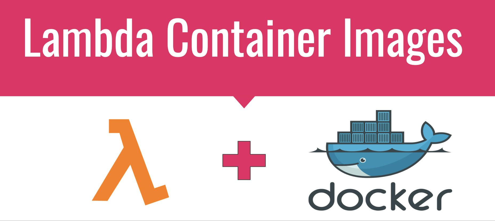
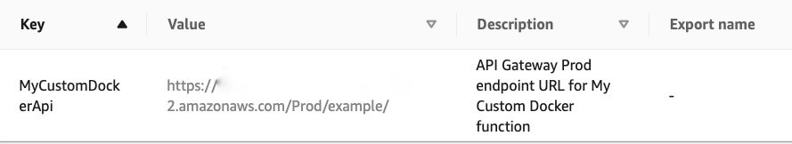

# Lambda Container Images


With the recent AWS [announcement](https://aws.amazon.com/es/blogs/aws/new-for-aws-lambda-container-image-support/) of container images support  for AWS Lambda, a machine learning developer can take advantage of up to 10 GB storage to deploy Deep Learning Models (Pytorch, Tensorflow) or more robust Decision Tree Models like the `XGBoost` library.



You can find on this repo examples deploying an [XGBoost](#xgboost_example) model and a [Pytorch](#pytorch_example) model. All the AWS infrastructure is automatically provisioned using [AWS CloudFormation](https://aws.amazon.com/cloudformation/) and [AWS Sam](https://aws.amazon.com/serverless/sam/). Additionally, a bash pipeline (`pipeline.sh`) is included to create the AWS resources needed, you can adapt it to your `CI/CD` service.

> **Note**. Make sure you have `awscli` and `aws-sam-cli` installed and configured in your system. For more information go [here](https://docs.aws.amazon.com/cli/latest/userguide/cli-configure-quickstart.html).


___

## <a name="pytorch_example"></a>Pytorch Example

___

### 1. Create an ECR Registry and an S3 Bucket

The first AWS services that we need to provision are an `ECR Registry` to push the docker images to and an S3 bucket to store the model artifacts and the stack's files.

Export the following environment variables with appropiate names


* `TEMPLATE_REGISTRY` (the stack's name of your registry).

* `TEMPLATE_LAMBDA` (the stack's name of your lambda).

* `PREFIX_LAMBDA` (s3 bucket key to upload lambda stack artifacts).

* `CAPABILITIES` (Capability type to create AWS stack, run `sam deploy --help` for more info).

For instance, 

```shell
export TEMPLATE_REGISTRY="pytorch-example"
export TEMPLATE_LAMBDA="pytorch-lambda"
export PREFIX_LAMBDA="sam_templates/pytorch-lambda"
export CAPABILITIES="CAPABILITY_NAMED_IAM"
```

and run 
```shell
bash pipeline.sh -s <stage> -r
```

where `<stage>` refers to the development stage (i.e. `dev`, `stage`, `prod`).

> **Note**. By default, the S3 Bucket takes the following name: `"${Project}-<stage>-${AWS::AccountId}"`. You can modify this name in the `registry.yaml` file.

___

### 2. Deploying the Pytorch Model

> **TL: DR** \
> On your terminal run 
>>> `bash pipeline.sh -s <stage> -d ./pytorch-example`

#### 2.A The Dockerfile
 
By default the `Dockerfile` uses `python:3.6-buster` image, a newer python version can be set changing the variable `RUNTIME_VERSION` inside the `/pytorch-example/DockerFile`. 

This base image must implement the Lambda Runtime API `awslambdaric`, the [docs](https://docs.aws.amazon.com/lambda/latest/dg/images-create.html) suggest the following

> The container image must implement the Lambda Runtime API. The AWS open-source runtime interface clients implement the API. You can add a runtime interface client to your preferred base image to make it compatible with Lambda.

#### 2.B Load the Pytorch model

The pretrained model ([Mobilenet V2](https://pytorch.org/hub/pytorch_vision_mobilenet_v2/)) is loaded from the `function` directory of the container. Optionally you can use [boto3](https://boto3.amazonaws.com/v1/documentation/api/1.9.42/guide/s3-example-download-file.html) to retrieve the model from an `S3` bucket.

#### 2.C The `deployment` step

Run the `push` step as follows

```shell
bash pipeline.sh -s <stage> -d <path>
```

where the `<path>` argument (defaults to current paht) refers to the directory where the `Dockerfile` and the `app` is located

For instance,
 
```shell
bash pipeline.sh -s dev -d ./pytorch-example
```


> **Note **: This will fail if you have not already run the `-r` flag in the `pipeline.sh`. Alternatively you can run them together: `bash pipeline.sh -s <stage> -r -d <path>`

___

### 4. Get Predictions

> **Note**: As the docker images contains `awslambdaric`, you can test the Docker container locally, refer to [this](https://github.com/aws/aws-lambda-python-runtime-interface-client#local-testing) instructions for more details.

Pytorch offers some [pretrained](https://pytorch.org/hub/research-models) models with code example Implementations. In this example, we're using [Mobilenet V2](https://pytorch.org/hub/pytorch_vision_mobilenet_v2/) to identify a dog's breed.

For this, the API endpoint expects the user to pass a valid public Url of a dog's image and a number of dog's match. 

```shell
curl -XPOST "here_goes_your_api_url" -H 'Content-Type: application/json' -d '{"input_url": "https://github.com/pytorch/hub/raw/master/images/dog.jpg", "n_predictions":5}'
```

where you can retrieve `here_goes_your_api_url` from the output of the lambda stack (`template.yaml`), see image below.



Expected result:

```
[["Samoyed, Samoyede", 83.03044128417969], ["Pomeranian", 6.988767623901367], ["keeshond", 1.2964094877243042], ["collie", 1.0797767639160156], ["Great Pyrenees", 0.9886746406555176]]
```

or input any publicly avaible dog image

```shell
curl -XPOST "here_goes_your_api_url" -H 'Content-Type: application/json' -d '{"input_url": "https://www.thesprucepets.com/thmb/sfuyyLvyUx636_Oq3Fw5_mt-PIc=/3760x2820/smart/filters:no_upscale()/adorable-white-pomeranian-puppy-spitz-921029690-5c8be25d46e0fb000172effe.jpg", "n_predictions":10}'
```

with result 

```shell
[["Pomeranian", 61.879791259765625], ["Maltese dog, Maltese terrier, Maltese", 13.713523864746094], ["Samoyed, Samoyede", 8.831860542297363], ["Arctic fox, white fox, Alopex lagopus", 3.6575238704681396], ["Japanese spaniel", 2.2257049083709717], ["keeshond", 2.205970048904419], ["papillon", 1.0087969303131104], ["barrow, garden cart, lawn cart, wheelbarrow", 0.5974907279014587], ["Pekinese, Pekingese, Peke", 0.5239897966384888], ["Chihuahua", 0.2706214189529419]]
```


___

## <a name="xgboost_example"></a>XGBoost Example

___

### 1. Setting up AWS Resources

Configure the stacks with an appropiate name. For XGBoost, we can set the following set of variables

```shell
export TEMPLATE_REGISTRY="xgboost-registry-example"
export TEMPLATE_LAMBDA="xgboost-lambda-example"
export PREFIX_LAMBDA="sam_templates/xgboost-lambda-example"
```

and run 

```shell
bash pipeline.sh -s <stage> -r -d ./xgboost-example
```

where `<stage>` refers to the development stage (i.e. `dev`, `stage`, `prod`). If you want to run each step at a time, refer to the Pytorch example for an explanation of each step.

> **Note**. Refer to the `xgboost-example/README.md` file, to choose how to install xgboost, through [miniconda](https://hub.docker.com/r/continuumio/miniconda3) or from source. 
>While installing xgboost through conda is more easy, it is not recommended for a production setting as your lambda runtimes will be higher thus a higher billed duration time than installing it from source.

___

### 2. Getting predictions

This example considers a trained XGBoost model with the [Boston](https://scikit-learn.org/stable/modules/generated/sklearn.datasets.load_boston.html) dataset. 

The API endpoint expects to receive a list of 13 features according to the original [dimensionality](https://scikit-learn.org/stable/modules/generated/sklearn.datasets.load_boston.html) of the data. The handler will transform the input list to a numpy array.

For example,

```shell
curl -XPOST "here_goes_your_api_url" -H 'Content-Type: application/json' -d '{"input_X": [0.95577, 0, 8.14, 0, 0.538, 6.047, 88.8, 4.4534, 4, 307, 21, 306.38, 17.28]}'
```

where you can retrieve `here_goes_your_api_url` from the output of the lambda stack (`template.yaml`), see image below.


with the following output 

```shell
{"message": "Succesful Prediction", "prediction": 14.716414451599121}
```

___

## References

AWS Lambda Runtime Interface Client. URL: https://github.com/aws/aws-lambda-python-runtime-interface-client

Creating Lambda Container Images. URL: https://docs.aws.amazon.com/lambda/latest/dg/images-create.html

Docker Commands Reference. URL: https://docs.docker.com/engine/reference/run/#entrypoint-default-command-to-execute-at-runtime

ECR Repository Resource. URL: https://docs.aws.amazon.com/es_es/AWSCloudFormation/latest/UserGuide/aws-resource-ecr-repository.html

News for AWS Lambda - Container Image Support. URL: https://aws.amazon.com/blogs/aws/new-for-aws-lambda-container-image-support/

Testing Lambda Container Images Locally. URL: https://docs.aws.amazon.com/lambda/latest/dg/images-test.html

Working with Lambda Layers and Extensions in Container Images. URL: https://aws.amazon.com/blogs/compute/working-with-lambda-layers-and-extensions-in-container-images/
